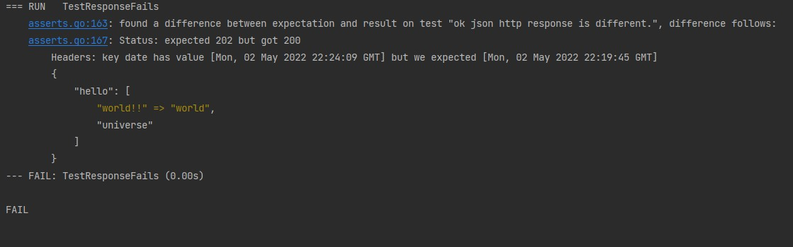

# expect

A go test tool to manage expectations.

### Notes on the origin of the tool

Expect is born as a spiritual continuation of [abide](https://github.com/beme/abide), a tool that I have used and liked,
but is no longer maintained. I originally thought about forking it but the changes I wanted to make were so many that a
clean slate was a better idea.

### What it does

Expect is intended to allow comparing large volumes of output in tests against a pre-established snapshot. This is not
intended for expectations of functions producing actual structs but large corpuses of either text, markup languages or
other protocol dumps that are not otherwise easy to compare.

A simple mechanism is provided to maintain up to date the snapshots is provided.

### Out of the box

We provide a set of supported types out of the box and the possibility to expand them:

* String: with simple diff output on differences
* String: with rich colored diff output on differences
* JSON: with comparison of equivalence rather than equality
* HTTP Response (WIP): with the ability to set specific comparators per ContentType
* HTTP Request (WIP): with the ability to set specific comparators per ContentType

Some aspects can be configuring by having a json file in your tests directory.

A universal mechanism to supply values as replacement of others is provided and left to be handled by the comparable
type

### Usage

There are two aspects about using this tool:

#### The flags

When running the tests (typically `go test .`) you can append, at the end, `--` and then the supported flags:

* `-u`: will update existing expectation snapshots with the passed comparable, it means one wants to set the current
  results as canon
* `-cleanup`: needs to be used along with `-u` and will delete all snapshots that are no longer use.

For `-cleanup` to work you need to also add a call to `Cleanup()` in your `TestMain` after `m.Run`

```go
package foo

import (
  "testing"

  "perri.to/expect"
)

func TestMain(m *testing.M) {
  m.Run()
  expect.Cleanup()
}
```

if the `-cleanup` flag was passed then that invocation will remove all not used snapshots, otherwise it will do nothing.

You can alternatively use `expect.MustCleanup()` which will return an error (which you will need to handle) if a cleanup
was in order but not requested.

#### The configuration

A sample configuration:

```json
{
  "grouping": "by_test_file",
  "snapshot_dir": "/optional/abs/or/relative/to/store/expectations",
  "replacers": {
    "json": {
      "valueA": "replacement",
      "valueB": "another_replacement"
    },
    "string": {
      "stringA": "stringReplacement"
    }
  }
}
```

Notice that this is all optional.

#### The code

There are two helpers provided to compare expectations.

```go
package foo

import (
  "testing"

  "perri.to/expect"
  "perri.to/expect/snapshots/comparabletypes"
)

func TestSomething(t *testing.T) {
  var result string
  // ... Do something
  c := comparabletypes.StringComparable(result)
  expect.FromSnapshot(t, "a name for our snapshot", &c)
}
```

This will yield error if:

* The string in `result` does not match what we have in store
* The name of the snapshot is repeated within the package (this saves a lot of time chasing random no-match errors that
  happen due to order of tests)

Now an example with a response.

```go
package foo

import (
  "net/http"
  "testing"

  "perri.to/expect"
  "perri.to/expect/snapshots/comparabletypes"
)

func TestSomethingNetworked(t *testing.T) {
  resp, err := http.Get("https://perri.to/random/json/endpoint") // no, it does not work
  if err != nil {
    t.Fatal(err)
  }
  c, err := comparabletypes.NewResponse(resp, true)
  if err != nil {
    t.Fatal(err)
  }
  // This is built-in but is a nice sample, you can override the built ins.
  c.RegisterHandler("application/json", comparabletypes.NewJSONFromString)
  expect.FromSnapshot(t, "a request to perrito", &c)
}
```

A resulting output for a failure of a json response would be (notice also differences in status and headers)



#### Examples

There are a few examples in the examples folder, these will fail and are mostly to display how it looks